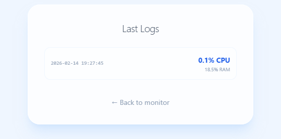

# 🚀 System Monitor Dashboard 




A minimalist system resource monitoring dashboard built with Flask, SQLite, and Tailwind CSS. This project demonstrates core competencies in backend development, task automation, data persistence, and containerized deployment.

## 🛠️ Tech Stack  
* Backend: Python 3.11, Flask.
* Database: SQLite (Log persistence).
* Frontend: Tailwind CSS (Responsive & minimalist UI).
* Automation: APScheduler (Data ingestion every 10 minutes).
* DevOps: Docker, Docker Compose, GitHub Actions (CI).

## 📂 Project Structure
/
├── app.py                # Main Flask logic and routes
├── requirements.txt      # Project dependencies
├── Dockerfile            # Docker image configuration
├── docker-compose.yml    # Service orchestration and volumes
├── .github/workflows/    # Continuous Integration (CI) pipeline
├── templates/            # HTML Views (Jinja2 + Tailwind)
│   ├── index.html        # Real-time monitor
│   └── logs.html         # Historical data
└── tests/                # Unit and integration tests
    └── test_app.py

## 🚀 Getting Started  
*1. Prerequisite: Docker*  
To run this project, you don't need to install Python or libraries manually. You only need Docker and Docker Compose.  

*2. Deployment*  
Clone the repository and run:
```
docker-compose up --build
The application will be available at http://localhost:5000.
```

## ⚙️ Engineering Highlights  
* Automated Ingestion: Features a BackgroundScheduler that autonomously records CPU and RAM usage without user intervention.
* Real Persistence: Data is stored in a mapped SQLite volume, ensuring logs are preserved even after container restarts.
* CI/CD Pipeline: Every code change is automatically validated via GitHub Actions, ensuring all tests pass before integration.
* Clean Architecture: Clear separation between business logic (Python), visualization (Jinja2/Tailwind), and quality assurance (Pytest).